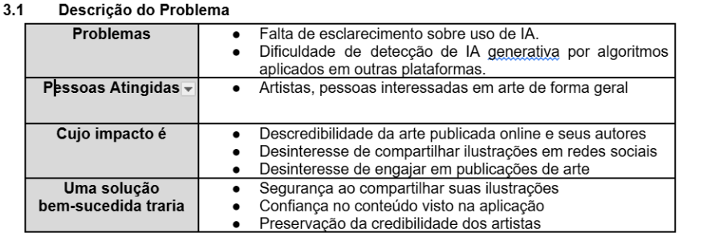
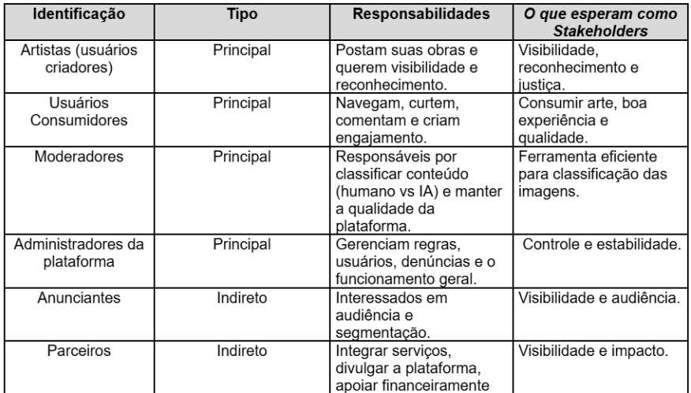

# Jello App

## Documentação em: https://drive.google.com/file/d/1DWPNx9kZsajK45ubuVHlNOIK7oi86HYj/view?usp=drive_link

### Finalidade
A finalidade deste documento é definir a visão que os Stakeholders têm do produto, em termos das funcionalidades e necessidades do sistema para atendê-las. 

### Escopo
O sistema terá como objetivo o compartilhamento de ilustrações dos usuários com mecanismos de detecção de imagens geradas por inteligência artificial.
A ideia é criar uma aplicação que promova a publicação de artes feitas por humanos, permitindo que usuários identifiquem e sinalizem IA generativa, com o intuito de minimizar postagens enganosas. 

### Principais Stakeholders e Usuários

### Padrões Aplicáveis

- Padrão Spring Moderno: o sistema adota arquitetura em camadas com organização orientada a domínios, permitindo melhor separação de responsabilidades e escalabilidade futura;

- Padrão REST para API: uso de endpoints HTTP (GET, POST, etc.);

- Utilização de JSON para troca de dados;

- Padrão MVC (Model-View-Controller) no Back-end;

- Organização por features (feature-based architecture) no Front-end (React)

- Autenticação baseada em token (JWT);

- Modelo de banco de dados relacional;

- Normalização de dados.

# Tecnolgias 

Lista de sugestões de tecnologias para a implementação do projeto.

## Backend

### Linguagem

- Java

### Framework

- Spring Boot

### Segurança e Autenticação

- Spring Security
- JWT
- OAuth2 (Talvez)

## Frontend

### Framework

- React

### Linguagem

- JavaScript ou TypeScript

### Build Tool

- Vite

### Estilização

- CSS3
- Bootstrap

## Database

- PostgreSQL

### Storage de imagens

- Armazenamento em Objeto
    - AWS S3
    - MinIO (self-hosted)

## Integrações

- REST API com Spring Web
- JSON

## Build e Gerenciamento

- Maven

### IDE recomendada

- IntelliJ para o Back com o Java
- VScode para o Front com o React

## Versionamento

- Git
- GitHub
